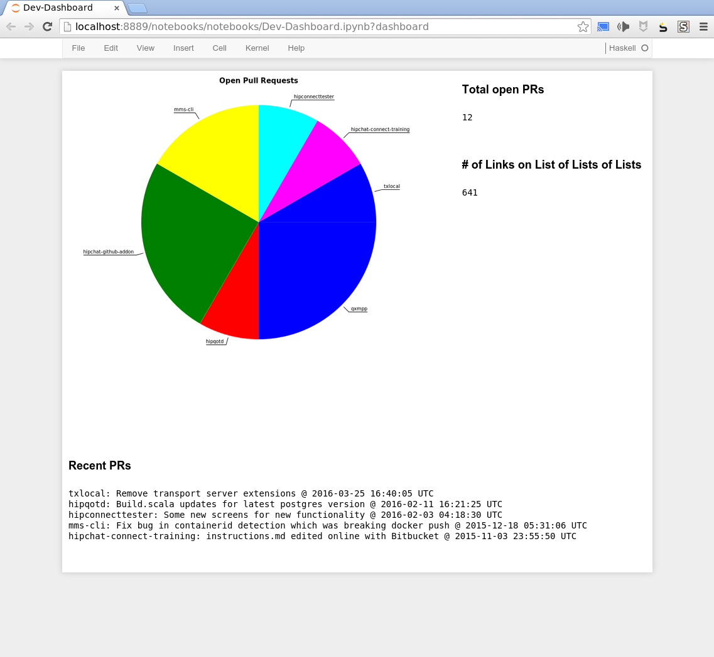

# Example of IHaskell+Jupyter+Dashboards integration

To use, clone recursively to get the submodules

````
git clone --recursive https://github.com/silky/ihaskell-jupyter-dashboard-demo
````

Then build the docker image (giving it a simple name)

````
docker build -t ihaskell-jdd .
````
and run it

````
PORT=8889 && docker run -it --volume $(pwd):/notebooks --publish 8889:$PORT ihaskell-jdd
````

Then browse to `localhost:8889` and go to the `notebooks` folder and you will see a sample notebook I've written. If you click the little dashboard icon, you should see a screenshot like so:



Enjoy!

Have a look around in the `Dockerfile` and the `/lib` folder for more comments. The `/lib` folder itself, and the way that is included in the Dockerfile is an example of how to include your own internal library into your docker image; and the Dockerfile also shows how you can bake in other stackage projects that you might want to work with in your image.

Note that my Dockerfile here is based on the one in `/ext/IHaskell`, but is adjusted so that we build under a common `LTS`, and installs the [jupyter-dashboard](https://github.com/jupyter-incubator/dashboards) plugin.
